#The Library is Too Dang Hot

## Description 

This simple build is meant to be an introduction to the Arduino and how to use it with a senor to get inputs from the world and to output via LED lights what the sensors say.

##Part list
- Ardiuno Uno
- Tempurature/Humidity Sensor, I used this [one](https://learn.adafruit.com/dht/overview)
- 3 LEDS, (any color will do but I got a green, yellow, and red one)
- 4 male to male jumper wires
- 1 small breadboard
- USB A to B cable (the one with the square end on it)

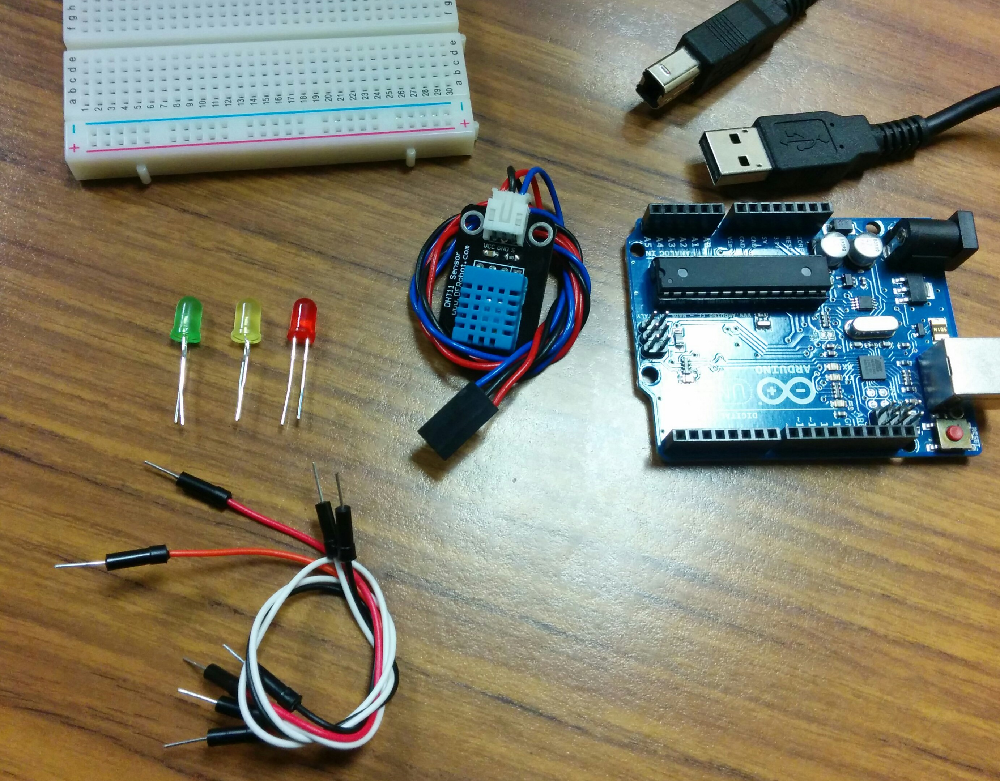

##The Build

### Connect the sensor

The sensor I have is on a board that is connected to a group of wires. (This is the kind that we have at the MakerSpace). You'll need 3 male to male jumper wires to connect everything together. If you look at the board there are three labels for the different wires: _VCC_, _GND_, and _S_. Begin with _VCC_, trace it down the wire all the way to the end of the black connector. Plug in a one end of wire here, plug the other end of the wire into the _5V_ socket on the Arduino. (The red wire in the picture below)

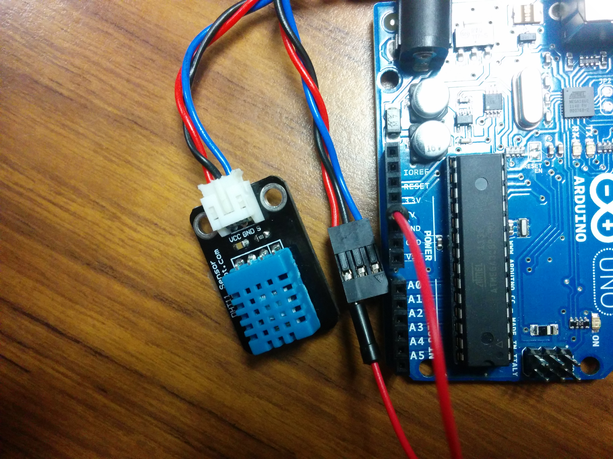

We are going to a similar process now with the _GND_ socket on the sensor.  Plug a wire in the black connector to the wire that corresponds to _GND_.  Plug the other end into the _GND_ socket on the Arduino, just like the black wire in the picture below. (It should be right next to the _5V_ plug  used just previous.)

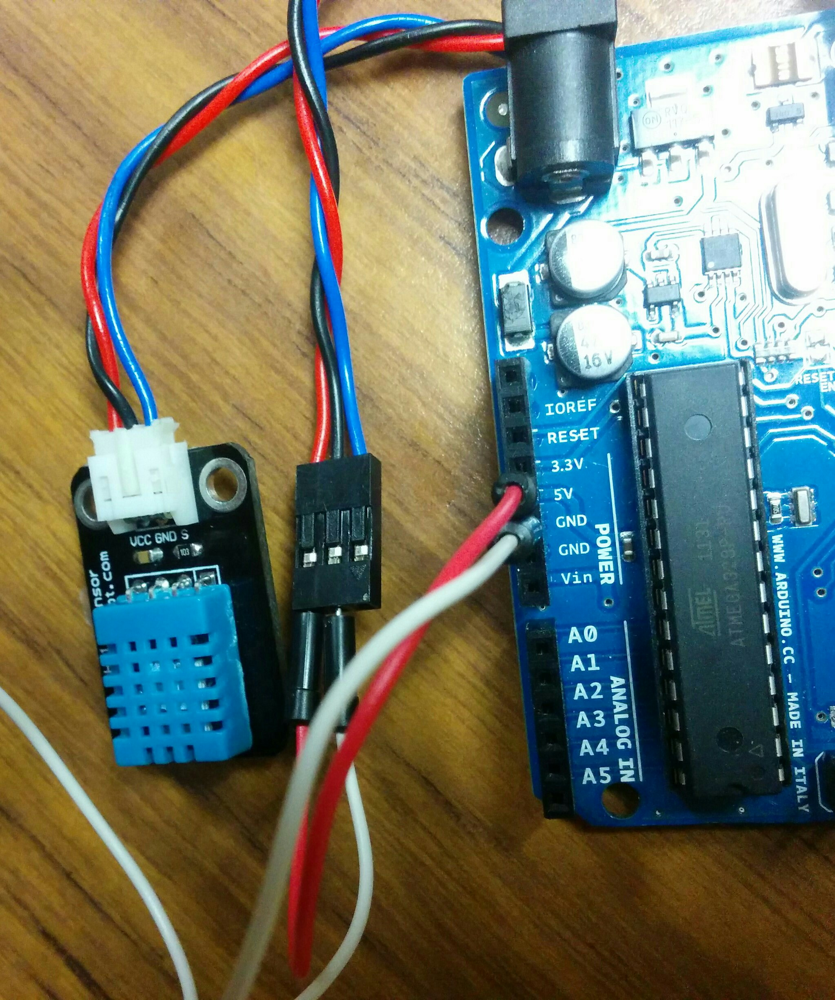

Finally we'll connect the last terminal to the Arduino which is _S_. Plug one end of the jumper into the black connector and the other into _DIGITAL PIN 2_ on the opposite side of the Arduino board. Here it is the orange wire.

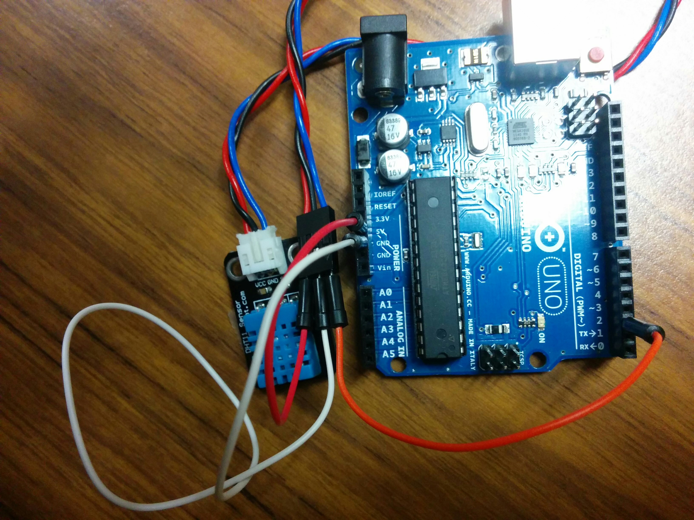

You should have your sensor connected to the Arduino board with three wires. Congrats on completing the first step

### Connect the LEDs

LEDs are like tiny lightbulbs. They can be a bit tricky to work with since they have to be plugged in a certain way and it is easy to get them in backward. However as long as you are careful it shouldn't be a problem.  When you lay the LED down you'll notice that there is a long end and a short end.

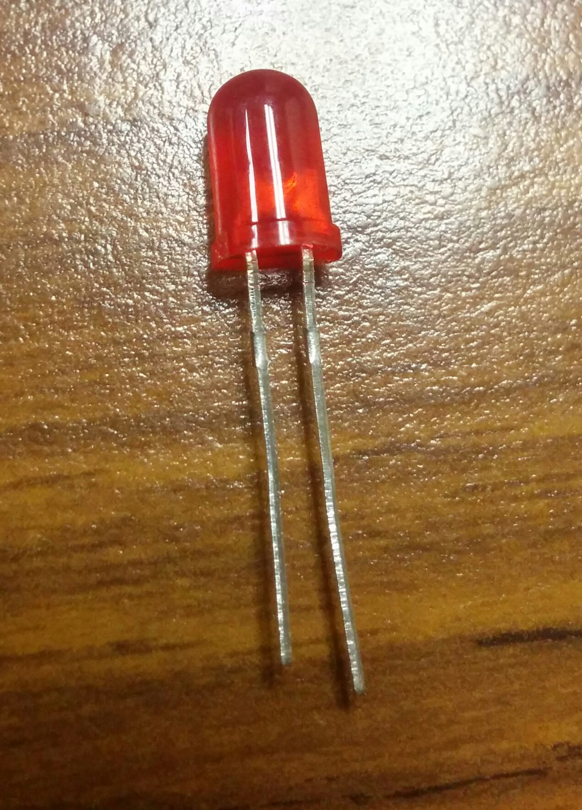

What we'll do is plug the long ends into the Arduino first. Plug the long end of the green LED into pin 8. Plug the long end of the yellow LED into pin 10.  Finally plug the long end of the red LED into pin 12.

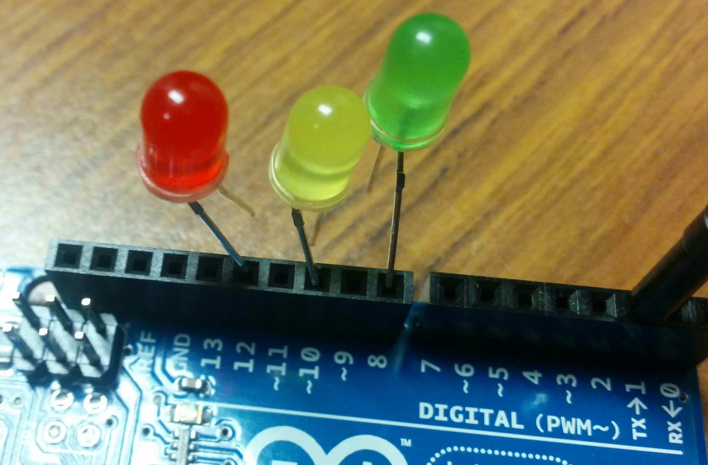

Next we need to connect the other end of the LED to our Arduino.  What we need to is 'ground' them (ie. complete the circuit with the board. This will be the most difficult step.  Take the breadboard and gingerly push the other end of the LED into the plugs along the blue negative row, the picture should help clarify.

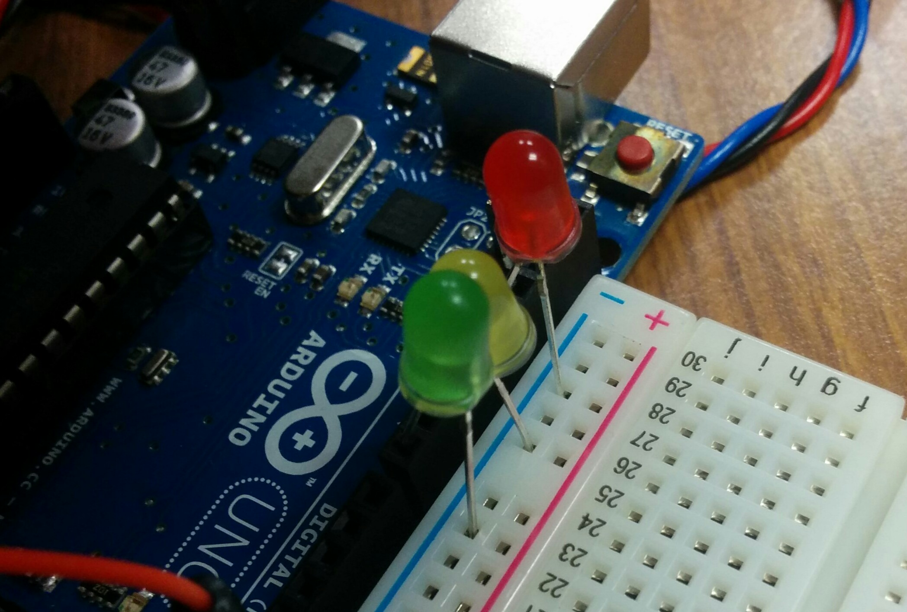

It doesn't matter which hole along that line as long as it is pushed in nice and tight on both sides. To complete our circuit we plug one of the jumper wires into another plug in the blue negative line and then connect it to the other _GND_ plug on the Arduino. Just like the black wire in the picture below.

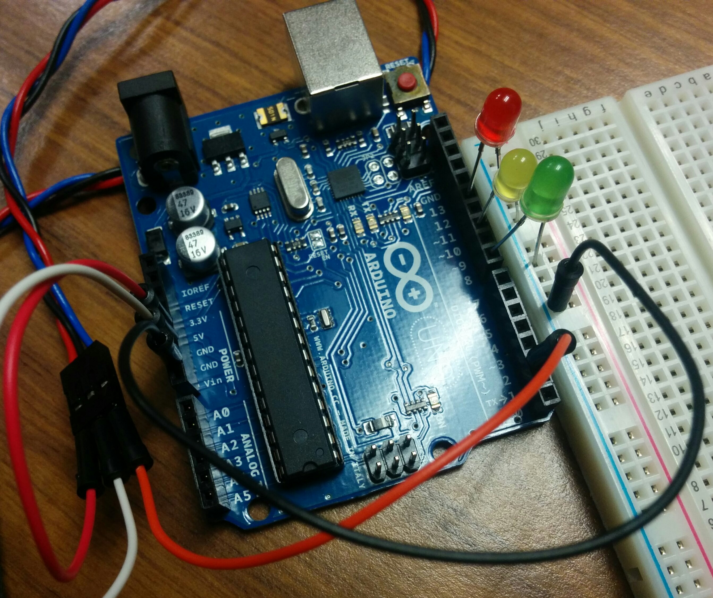

There all done!

### Connect the Arduino to the computer

Perhaps the easiest part of the build. Just connect the USB cable square end to the Arduino, the other end connect to an available USB port.

## Upload the to code to the Arduino

This will vary depending on what kind of computer you have (ie MAC, Linux etc). You need to have the [Arduino IDE](https://www.arduino.cc/en/Main/Software) installed on the computer.

Download the Zip file from [GitHub](https://github.com/BrockUniversityLibrary/tlitdh) page and extract the contents of the file somewhere. Navigate to the `tlitdh` folder and double click `tlitdh.ino` and it should launch the IDE, looking something like the following:

Under the _Tools_ >  _Port_ that the Arduino is selected.

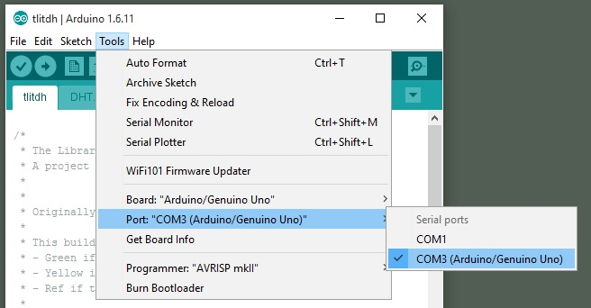

This part can get tricky, if you need more details check [this](https://www.arduino.cc/en/Guide/Windows) out.

Once that is completed click the icon that looks like an arrow pointing to the right. This will upload the code to the board. If it works you'll see a little message.

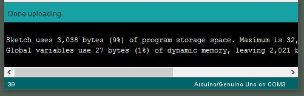

## Change the temperature!

If evertything works the Arduino will reboot and then the cool start-up animation will happen. Depending on the temperature of the room a different LED will turn on.

- Cool as a cucumber green

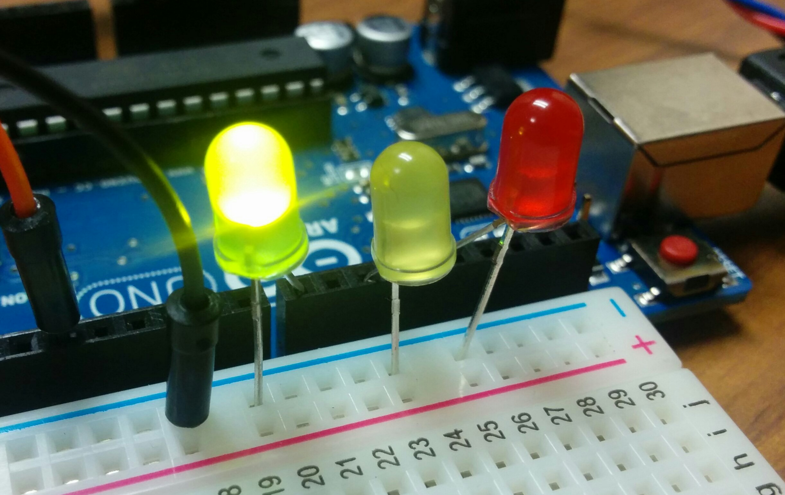

- Mildy uncomfortable yellow

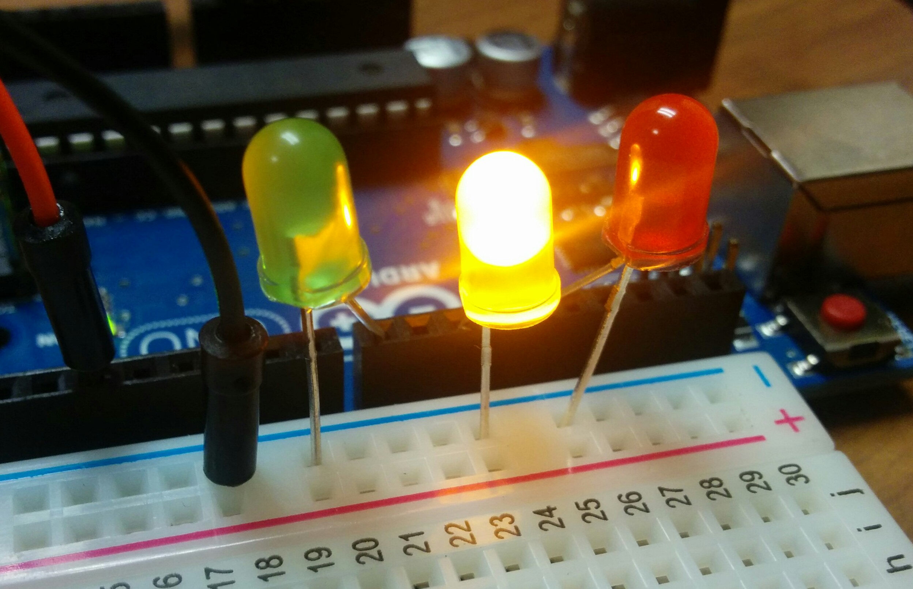

- Red hot

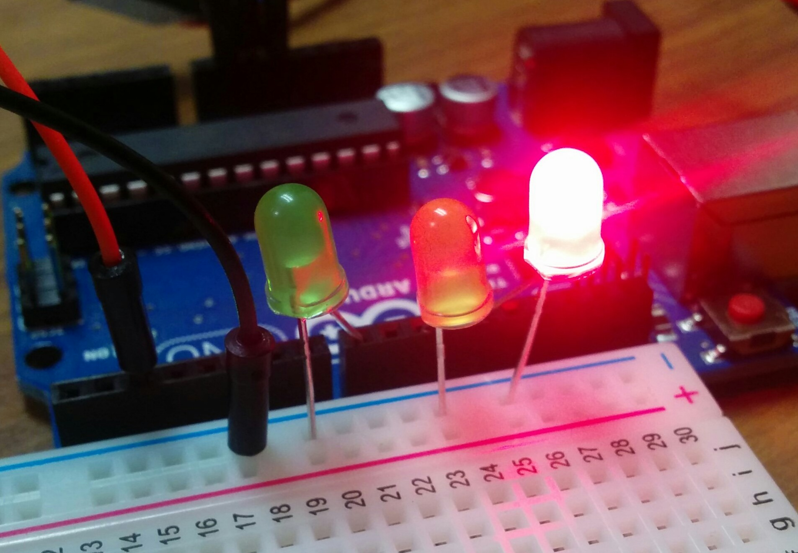

You can hold the sensor in your hand to trick it into warming up. Similarly you can put it next to your water bottle to cool off.  If for some reason the colors don't change you might need to use different temperature settings in the source code.  Check out the file in the Arduino IDE for more details on how that would work.

## Conclusion

You'll now be able to tell if the Library is too Dang Hot.  Try experimenting with the build in any of the following ways:

- Making an even 'cooler' start-up animation
- Change the tempurature ranges to different values
- Add more LEDS

If you add a nifty feature please submit it with a [pull-request](https://help.github.com/articles/creating-a-pull-request/). If you'd like to borrow the parts to put this together please stop by the [Brock Library Makerspace](https://make.library.brocku.ca). 

Have an idea for a crafty make project?  Lets us know.

Project originally devised by Tim R [@elibtronic](https://twitter.com/elibtronic)